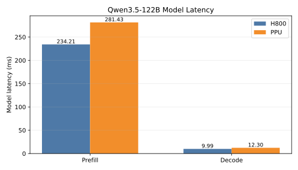
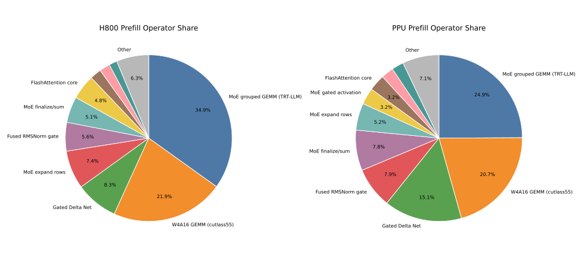
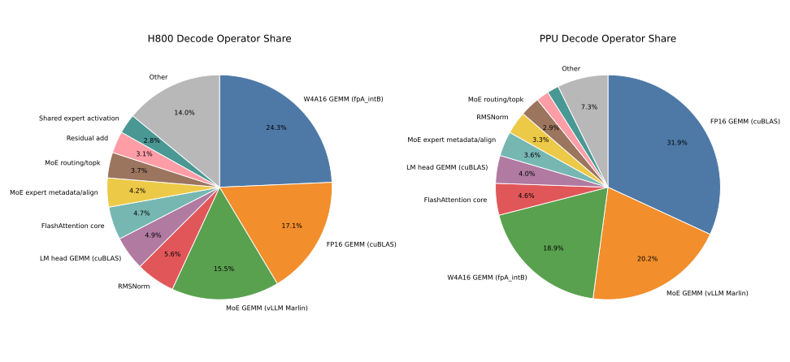
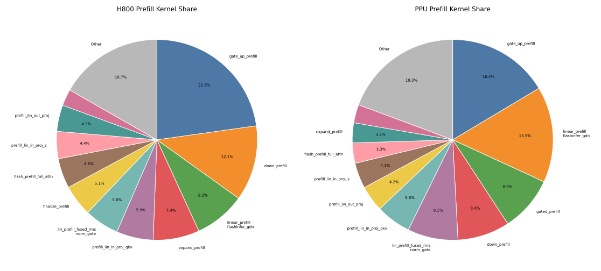
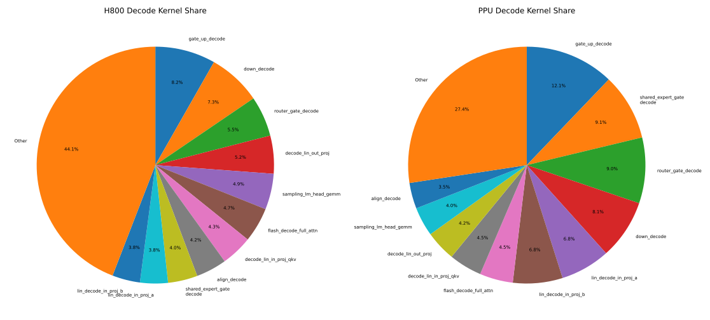
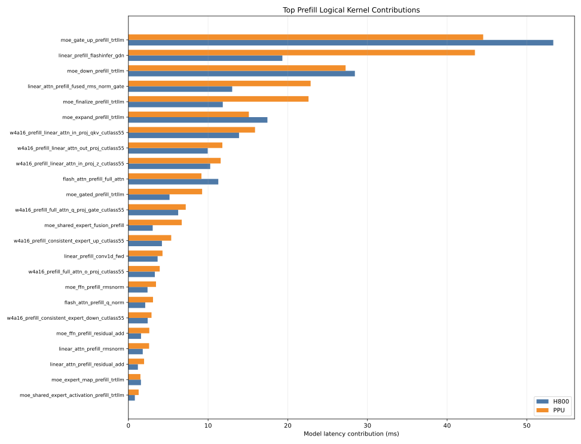
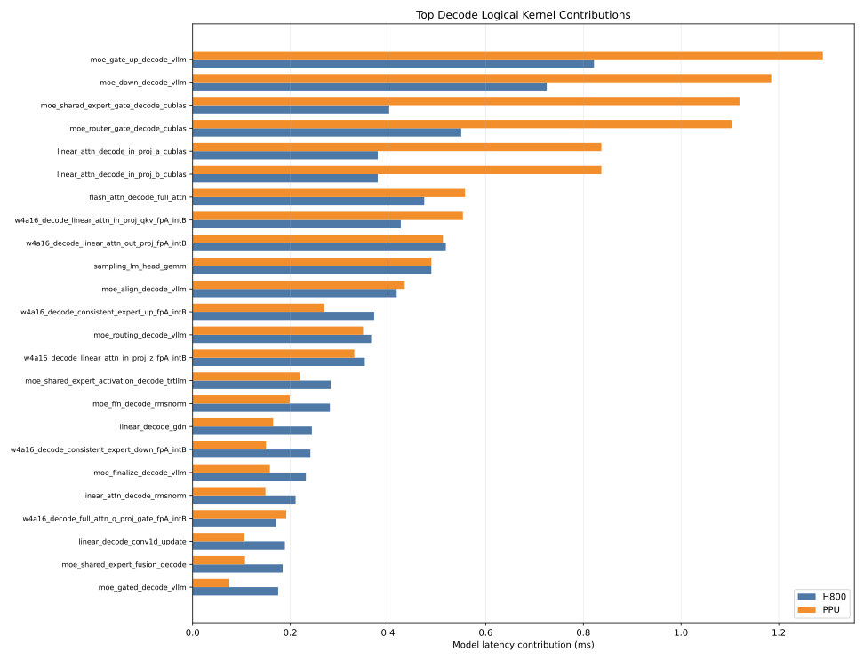

# Qwen3.5-122B-A10B Benchmark Results

This file records the current H800 Nsight Compute result set and the provided
PPU perfstatistics result set for the standalone Qwen3.5-122B-A10B kernel mix.
Operator shapes and source mappings are kept in [OPERATOR_COVERAGE.md](OPERATOR_COVERAGE.md).

## Measurement Notes

The H800 columns are from an NCU capture:

| Column | Meaning |
|---|---|
| `H800 kernels` | Number of profiled CUDA kernel rows for this benchmark case. |
| `H800 cycles_avg` | Sum of `sm__cycles_elapsed.avg` across kernel rows. |
| `H800 cycles_max` | Sum of `sm__cycles_elapsed.max` across kernel rows. |
| `H800 duration_ns` | Sum of profiled GPU kernel durations in ns. |
| `H800 latency_us` | `H800 duration_ns / 1000`. |

The PPU columns are from per-case `perfstatistics.log` summaries. PPU latency is
`compute_cycles / 1.5GHz`.

For multi-kernel cases, H800 `duration_ns` is the sum of kernel durations, not
host-side wall time between kernels. It intentionally excludes CPU launch cost
and cuBLAS/Python dispatch gaps. A `-` means that device/result set did not
include that case and no identical-shape proxy was available.

Default model-repeat assumptions used by `bench_all.sh` and the summary tools:

| Parameter | Value |
|---|---:|
| hidden_size | 3072 |
| full_attention_layers | 12 |
| linear_attention_layers | 36 |
| moe_ffn_layers | 48 |
| prefill tokens | 3823 |
| decode tokens | 1 |
| num_experts | 256 |
| num_experts_per_tok | 8 |
| moe_intermediate_size | 1024 |
| shared_expert_intermediate_size | 1024 |
| vocab_size | 248320 |

## Coverage Gaps

Using unique benchmark shapes/operators, the H800 NCU result set covers every
current `bench_all.sh --list` case. The provided PPU result set is missing only
one unique operator:

- `sampling_lm_head_gemm`

Several exact labels are absent from one or both raw result tables because
`bench_all.sh` deduplicates identical shapes. In the tables below, those rows
are filled with the proxy measurements listed here:

| Missing exact label | Covered by proxy |
|---|---|
| `linear_attn_decode_in_proj_b_cublas` | `linear_attn_decode_in_proj_a_cublas` |
| `linear_attn_prefill_in_proj_b_cublas` | `linear_attn_prefill_in_proj_a_cublas` |
| `flash_attn_decode_rmsnorm` | `linear_attn_decode_rmsnorm` |
| `flash_attn_prefill_rmsnorm` | `linear_attn_prefill_rmsnorm` |
| `flash_attn_decode_residual_add` | `linear_attn_decode_residual_add` |
| `flash_attn_prefill_residual_add` | `linear_attn_prefill_residual_add` |
| `w4a16_prefill_full_attn_v_proj_cutlass55` | `w4a16_prefill_full_attn_k_proj_cutlass55` |
| `w4a16_prefill_full_attn_o_proj_cutlass55` | `w4a16_prefill_linear_attn_out_proj_cutlass55` |
| `w4a16_decode_full_attn_v_proj_fpA_intB` | `w4a16_decode_full_attn_k_proj_fpA_intB` |
| `w4a16_decode_full_attn_o_proj_fpA_intB` | `w4a16_decode_linear_attn_out_proj_fpA_intB` |
| `moe_ffn_decode_rmsnorm` | `linear_attn_decode_rmsnorm` |
| `moe_ffn_prefill_rmsnorm` | `linear_attn_prefill_rmsnorm` |
| `moe_ffn_decode_residual_add` | `linear_attn_decode_residual_add` |
| `moe_ffn_prefill_residual_add` | `linear_attn_prefill_residual_add` |

## Model-Level Comparison

Totals below apply the model-repeat assumptions above: 12 full-attention
layers, 36 linear-attention layers, 48 MoE-FFN layers, and one sampling step for
prefill and decode. The PPU result set does not include `sampling_lm_head_gemm`;
for model-level totals and plots only, that row is imputed from the H800 value
(`488.736 us`) and should be treated as a placeholder.

Regenerate the charts with:

```bash
python helpers/plot_122b_comparison.py \
  --input bench_122B.md \
  --out-dir figures/bench_122B
```

| Phase | H800 total ms | PPU total ms | PPU/H800 |
|---|---:|---:|---:|
| prefill | 234.213 | 288.021 | 1.230x |
| decode | 9.992 | 12.225 | 1.223x |



### Operator Share

These pies aggregate logical operator classes after applying layer-count
multipliers. The long tail is grouped into `Other`.





### Kernel Contributions

These pies and bars compare logical kernel/case contributions to total model
latency. The pies show where total time goes; the bars make absolute
H800-vs-PPU deltas visible.









Largest prefill deltas:

| Case | H800 ms | PPU ms | Delta |
|---|---:|---:|---:|
| `linear_prefill_flashinfer_gdn` | 19.325 | 43.492 | +24.167 |
| `moe_finalize_prefill_trtllm` | 11.846 | 22.607 | +10.762 |
| `linear_attn_prefill_fused_rms_norm_gate` | 13.026 | 22.870 | +9.845 |
| `moe_gate_up_prefill_trtllm` | 53.327 | 44.529 | -8.798 |
| `moe_gated_prefill_trtllm` | 5.161 | 9.253 | +4.092 |

Largest decode deltas:

| Case | H800 ms | PPU ms | Delta |
|---|---:|---:|---:|
| `moe_shared_expert_gate_decode_cublas` | 0.402 | 1.120 | +0.717 |
| `moe_router_gate_decode_cublas` | 0.550 | 1.104 | +0.554 |
| `moe_gate_up_decode_vllm` | 0.822 | 1.290 | +0.469 |
| `moe_down_decode_vllm` | 0.725 | 1.185 | +0.460 |
| `linear_attn_decode_in_proj_b_cublas` | 0.379 | 0.837 | +0.458 |

## Flash-Attn

### Decode

| Case | H800 kernels | H800 cycles_avg | H800 cycles_max | H800 duration_ns | H800 latency_us | PPU cycles | PPU latency_us@1.5GHz |
|---|---:|---:|---:|---:|---:|---:|---:|
| `flash_attn_decode_rmsnorm` | 1 | 9231.240 | 9234 | 5856 | 5.856 | 6213 | 4.142 |
| `w4a16_decode_full_attn_q_proj_gate_fpA_intB` | 1 | 22334.090 | 22458 | 14240 | 14.240 | 23959 | 15.973 |
| `w4a16_decode_full_attn_k_proj_fpA_intB` | 1 | 11493.730 | 11500 | 7264 | 7.264 | 8020 | 5.347 |
| `w4a16_decode_full_attn_v_proj_fpA_intB` | 1 | 11493.730 | 11500 | 7264 | 7.264 | 8020 | 5.347 |
| `flash_attn_decode_q_norm` | 1 | 6608.640 | 6611 | 4224 | 4.224 | 2737 | 1.825 |
| `flash_attn_decode_k_norm` | 1 | 6603.450 | 6609 | 4160 | 4.160 | 2872 | 1.915 |
| `flash_attn_decode_full_attn` | 2 | 62353.970 | 62380 | 39520 | 39.520 | 69718 | 46.479 |
| `w4a16_decode_full_attn_o_proj_fpA_intB` | 1 | 22811.050 | 22850 | 14400 | 14.400 | 21352 | 14.235 |
| `flash_attn_decode_residual_add` | 1 | 5151.470 | 5155 | 3264 | 3.264 | 3228 | 2.152 |


### Prefill

| Case | H800 kernels | H800 cycles_avg | H800 cycles_max | H800 duration_ns | H800 latency_us | PPU cycles | PPU latency_us@1.5GHz |
|---|---:|---:|---:|---:|---:|---:|---:|
| `flash_attn_prefill_rmsnorm` | 1 | 79363.090 | 79459 | 50016 | 50.016 | 108227 | 72.151 |
| `w4a16_prefill_full_attn_q_proj_gate_cutlass55` | 1 | 805173.480 | 808926 | 520576 | 520.576 | 899473 | 599.649 |
| `w4a16_prefill_full_attn_k_proj_cutlass55` | 1 | 62091.330 | 62328 | 39552 | 39.552 | 64527 | 43.018 |
| `w4a16_prefill_full_attn_v_proj_cutlass55` | 1 | 62091.330 | 62328 | 39552 | 39.552 | 64527 | 43.018 |
| `flash_attn_prefill_q_norm` | 1 | 279564.500 | 279614 | 175872 | 175.872 | 385933 | 257.289 |
| `flash_attn_prefill_k_norm` | 1 | 22809.360 | 22846 | 14400 | 14.400 | 25927 | 17.285 |
| `flash_attn_prefill_full_attn` | 1 | 1487535.360 | 1490135 | 940224 | 940.224 | 1145923 | 763.949 |
| `w4a16_prefill_full_attn_o_proj_cutlass55` | 1 | 420792.230 | 425083 | 276544 | 276.544 | 491333 | 327.555 |
| `flash_attn_prefill_residual_add` | 1 | 52426.420 | 52459 | 33024 | 33.024 | 81945 | 54.630 |


## Linear-Attn

### Decode

| Case | H800 kernels | H800 cycles_avg | H800 cycles_max | H800 duration_ns | H800 latency_us | PPU cycles | PPU latency_us@1.5GHz |
|---|---:|---:|---:|---:|---:|---:|---:|
| `linear_attn_decode_rmsnorm` | 1 | 9231.240 | 9234 | 5856 | 5.856 | 6213 | 4.142 |
| `linear_attn_decode_in_proj_a_cublas` | 2 | 16649.140 | 16658 | 10528 | 10.528 | 34871 | 23.247 |
| `linear_attn_decode_in_proj_b_cublas` | 2 | 16649.140 | 16658 | 10528 | 10.528 | 34871 | 23.247 |
| `w4a16_decode_linear_attn_in_proj_qkv_fpA_intB` | 1 | 18618.710 | 18699 | 11840 | 11.840 | 23057 | 15.371 |
| `w4a16_decode_linear_attn_in_proj_z_fpA_intB` | 1 | 15418.240 | 15474 | 9792 | 9.792 | 13791 | 9.194 |
| `linear_decode_conv1d_update` | 1 | 8286.940 | 8289 | 5248 | 5.248 | 4422 | 2.948 |
| `linear_decode_gdn` | 1 | 10672.440 | 10693 | 6784 | 6.784 | 6869 | 4.579 |
| `linear_attn_decode_fused_rms_norm_gate` | 1 | 6774.830 | 6781 | 4288 | 4.288 | 3684 | 2.456 |
| `w4a16_decode_linear_attn_out_proj_fpA_intB` | 1 | 22811.050 | 22850 | 14400 | 14.400 | 21352 | 14.235 |
| `linear_attn_decode_residual_add` | 1 | 5151.470 | 5155 | 3264 | 3.264 | 3228 | 2.152 |


### Prefill

| Case | H800 kernels | H800 cycles_avg | H800 cycles_max | H800 duration_ns | H800 latency_us | PPU cycles | PPU latency_us@1.5GHz |
|---|---:|---:|---:|---:|---:|---:|---:|
| `linear_attn_prefill_rmsnorm` | 1 | 79363.090 | 79459 | 50016 | 50.016 | 108227 | 72.151 |
| `linear_attn_prefill_in_proj_a_cublas` | 1 | 20938.480 | 20985 | 13440 | 13.440 | 33721 | 22.481 |
| `linear_attn_prefill_in_proj_b_cublas` | 1 | 20938.480 | 20985 | 13440 | 13.440 | 33721 | 22.481 |
| `w4a16_prefill_linear_attn_in_proj_qkv_cutlass55` | 1 | 592874.410 | 596695 | 385696 | 385.696 | 662199 | 441.466 |
| `w4a16_prefill_linear_attn_in_proj_z_cutlass55` | 1 | 432869.740 | 437242 | 285152 | 285.152 | 482531 | 321.687 |
| `linear_prefill_conv1d_fwd` | 1 | 161232.470 | 161616 | 101792 | 101.792 | 178356 | 118.904 |
| `linear_prefill_flashinfer_gdn` | 1 | 850767.770 | 851348 | 536800 | 536.800 | 1812153 | 1208.102 |
| `linear_attn_prefill_fused_rms_norm_gate` | 1 | 575178.060 | 575254 | 361824 | 361.824 | 952929 | 635.286 |
| `w4a16_prefill_linear_attn_out_proj_cutlass55` | 1 | 420792.230 | 425083 | 276544 | 276.544 | 491333 | 327.555 |
| `linear_attn_prefill_residual_add` | 1 | 52426.420 | 52459 | 33024 | 33.024 | 81945 | 54.630 |


## MoE-FFN

### Decode

| Case | H800 kernels | H800 cycles_avg | H800 cycles_max | H800 duration_ns | H800 latency_us | PPU cycles | PPU latency_us@1.5GHz |
|---|---:|---:|---:|---:|---:|---:|---:|
| `moe_ffn_decode_rmsnorm` | 1 | 9231.240 | 9234 | 5856 | 5.856 | 6213 | 4.142 |
| `w4a16_decode_consistent_expert_up_fpA_intB` | 1 | 12252.640 | 12259 | 7744 | 7.744 | 8419 | 5.613 |
| `moe_shared_expert_activation_decode_trtllm` | 1 | 9294.920 | 9300 | 5888 | 5.888 | 6848 | 4.565 |
| `w4a16_decode_consistent_expert_down_fpA_intB` | 1 | 7944.020 | 7962 | 5024 | 5.024 | 4695 | 3.130 |
| `moe_router_gate_decode_cublas` | 2 | 18050.210 | 18140 | 11456 | 11.456 | 34498 | 22.999 |
| `moe_routing_decode_vllm` | 1 | 12085.060 | 12090 | 7616 | 7.616 | 10905 | 7.270 |
| `moe_align_decode_vllm` | 2 | 13724.260 | 13732 | 8704 | 8.704 | 13567 | 9.045 |
| `moe_gate_up_decode_vllm` | 1 | 26597.980 | 26721 | 17120 | 17.120 | 40321 | 26.881 |
| `moe_gated_decode_vllm` | 1 | 5744.880 | 5750 | 3648 | 3.648 | 2350 | 1.567 |
| `moe_down_decode_vllm` | 1 | 23587.170 | 23632 | 15104 | 15.104 | 37020 | 24.680 |
| `moe_finalize_decode_vllm` | 1 | 7634.830 | 7642 | 4832 | 4.832 | 4947 | 3.298 |
| `moe_shared_expert_gate_decode_cublas` | 2 | 13200.280 | 13212 | 8384 | 8.384 | 34988 | 23.325 |
| `moe_shared_expert_fusion_decode` | 1 | 6080.480 | 6084 | 3840 | 3.840 | 3353 | 2.235 |
| `moe_ffn_decode_residual_add` | 1 | 5151.470 | 5155 | 3264 | 3.264 | 3228 | 2.152 |


### Prefill

| Case | H800 kernels | H800 cycles_avg | H800 cycles_max | H800 duration_ns | H800 latency_us | PPU cycles | PPU latency_us@1.5GHz |
|---|---:|---:|---:|---:|---:|---:|---:|
| `moe_ffn_prefill_rmsnorm` | 1 | 79363.090 | 79459 | 50016 | 50.016 | 108227 | 72.151 |
| `w4a16_prefill_consistent_expert_up_cutlass55` | 1 | 132728.790 | 134702 | 87648 | 87.648 | 167896 | 111.931 |
| `moe_shared_expert_activation_prefill_trtllm` | 1 | 26612.330 | 26697 | 16832 | 16.832 | 40187 | 26.791 |
| `w4a16_prefill_consistent_expert_down_cutlass55` | 1 | 77089.480 | 77699 | 50400 | 50.400 | 90627 | 60.418 |
| `moe_router_gate_prefill_cublas` | 1 | 24605.770 | 24756 | 15968 | 15.968 | 33694 | 22.463 |
| `moe_routing_prefill_trtllm` | 1 | 19699.640 | 19716 | 12416 | 12.416 | 11896 | 7.931 |
| `moe_expert_map_prefill_trtllm` | 3 | 52065.540 | 52089 | 32800 | 32.800 | 47107 | 31.405 |
| `moe_expand_prefill_trtllm` | 1 | 577938.230 | 577951 | 363488 | 363.488 | 472476 | 314.984 |
| `moe_gate_up_prefill_trtllm` | 1 | 1765885.640 | 1766003 | 1110976 | 1110.976 | 1391534 | 927.689 |
| `moe_gated_prefill_trtllm` | 1 | 170279.360 | 170736 | 107520 | 107.520 | 289141 | 192.761 |
| `moe_down_prefill_trtllm` | 1 | 939983.710 | 940907 | 592192 | 592.192 | 851867 | 567.911 |
| `moe_finalize_prefill_trtllm` | 1 | 392343.940 | 392360 | 246784 | 246.784 | 706473 | 470.982 |
| `moe_shared_expert_gate_prefill_cublas` | 1 | 27503 | 27568 | 17376 | 17.376 | 33719 | 22.479 |
| `moe_shared_expert_fusion_prefill` | 1 | 100865.060 | 100943 | 63520 | 63.520 | 209201 | 139.467 |
| `moe_ffn_prefill_residual_add` | 1 | 52426.420 | 52459 | 33024 | 33.024 | 81945 | 54.630 |


## Sampling

`bench_all.sh` records the sampling cases once. The model-level comparison
above counts one sampling step in both prefill and decode.

| Case | H800 kernels | H800 cycles_avg | H800 cycles_max | H800 duration_ns | H800 latency_us | PPU cycles | PPU latency_us@1.5GHz |
|---|---:|---:|---:|---:|---:|---:|---:|
| `sampling_lm_head_gemm` | 1 | 769939.480 | 771560 | 488736 | 488.736 | - | - |
| `sampling_topk_mask_logits` | 1 | 75616.240 | 75620 | 47584 | 47.584 | 86641 | 57.761 |
| `sampling_softmax` | 2 | 74527.520 | 74538 | 46944 | 46.944 | 70017 | 46.678 |
| `sampling_top_p` | 1 | 44388.740 | 44391 | 27968 | 27.968 | 63841 | 42.561 |

## Interpretation Notes

- Decode cuBLAS small GEMMs (`M=1`) are represented by several cuBLASLt kernel
  rows. H800 kernel-only totals exclude host dispatch gaps, so compare them
  against nsys/NCU kernel durations rather than PyTorch eager event times.
- This H800 result set includes FlashAttention core, fused RMSNorm gate,
  TRT-LLM shared-expert activation, and `moe_align_decode_vllm`, which were
  missing from the earlier H800 table.
- PPU sampling is incomplete only because `sampling_lm_head_gemm` is absent from
  the provided PPU result set.
- Every other current `bench_all.sh --list` case is either present by exact
  label or represented by the identical-shape proxy measurements listed above.
